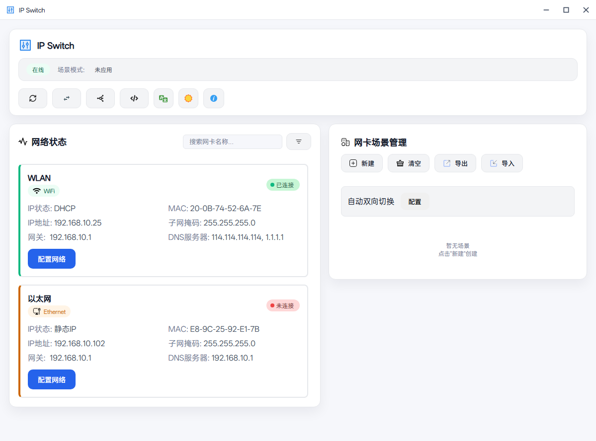

# IP Switch

基于 Tauri 的 IP、Hosts、Proxy 配置修改切换器，具有场景切换功能。

> [!NOTE]
> ⚠️ **需要管理员权限运行**：修改网络配置、Hosts文件和代理设置需要管理员权限。



下载：https://github.com/hoochanlon/Ip-Switch/releases

## 功能特性

- ✅ 网络状态显示（WiFi/有线网络、静态/动态IP、IP详情）
- ✅ IP 配置修改（静态IP/DHCP切换）
- ✅ Hosts 文件编辑
- ✅ 代理配置管理
- ✅ 场景切换（保存/加载配置场景）

## 开发模式

环境要求

- Node.js 18+
- Rust 1.70+
- Windows 10/11（需要管理员权限）

安装依赖 & 启动运行

```bash
npm install
npm run tauri dev
```
构建

```bash
npm run tauri build
```

## hosts ＆ DNS

**hosts**


* [ineo6/hosts](https://github.com/ineo6/hosts)
* [国立台湾大学DNS](https://isms.ntu.edu.tw/DNSlist.html)
* [HOSTS Blocker常用列表](https://jplop.neocities.org/teac_hosts_block)
* [StevenBlack/hosts](https://github.com/StevenBlack/hosts)
* [hagezi/dns-blocklists](https://github.com/hagezi/dns-blocklists)

**DNS**

https://www.dolingou.com/article/dns-servers-guide

* [DNS SB](https://dns.sb)
* [Next DNS](https://my.nextdns.io/a9bdef/setup)
* [Quad9](https://quad9.net/)
