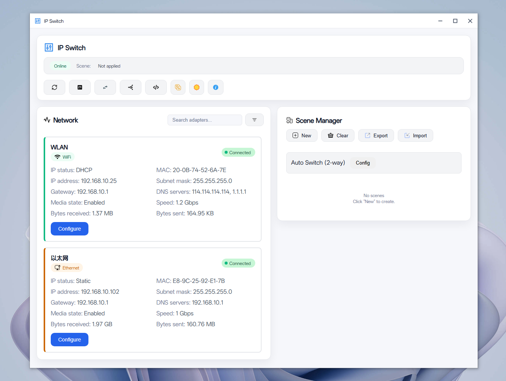
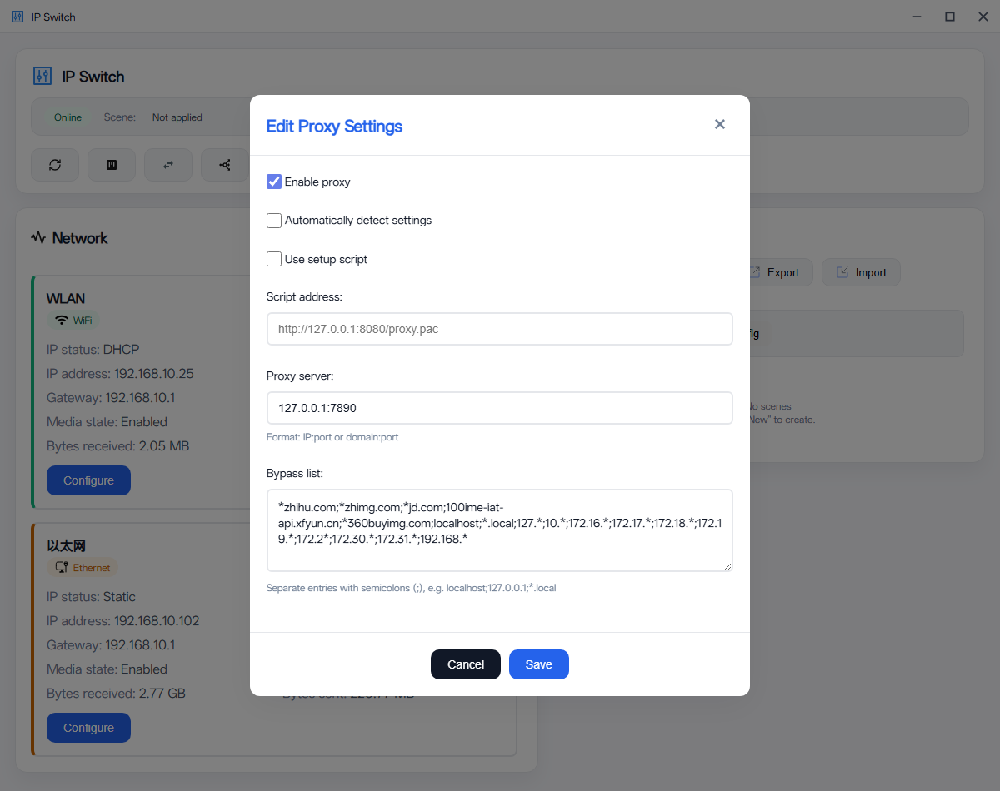

# IP Switch

<p align="center">
  <br/>
    
   
    <br/> <br/>
  随心切换场景，Hosts 与代理智能协同，实时流量监控 + 网络状态提醒，让每一次上网都自由而从容。
</p>

## 功能特性

> [!NOTE]
> **需要管理员权限运行**：修改网络配置需要管理员权限。


- ✅ 网络状态显示（WiFi/有线网络、静态/动态IP、IP详情）
- ✅ IP 配置修改（静态IP/DHCP切换）
- ✅ 场景切换（保存/加载配置场景）
- ✅ Hosts 文件编辑，支持远程更新
- ✅ 代理配置管理，支持远程PAC更新
- ✅ 托盘颜色可自定义，以及能够根据不同的网络状态显示不同的颜色


下载：https://github.com/hoochanlon/Ip-Switch/releases

## 截图展示

软件配置

<!--  -->




配置效果


## 开发模式

环境要求

- Node.js 18+
- Rust 1.70+
- Windows 10/11（需要管理员权限）

安装依赖 & 启动运行

```bash
npm install
npm run tauri dev
```
构建

```bash
npm run tauri build
```

NSIS 封装打包

nullsoft scriptable install system

软件下载：

* https://www.mefcl.com/nsis-3-0-5.html
* https://www.cnblogs.com/NSIS/p/16581122.html

操作过程：编译 NSI 脚本 > 文件 > 加载脚本 > ip-switch.nsi


## Proxy

> [!NOTE]
> 广告屏蔽规则 ≠ Clash 订阅代理规则，前者是“精细杀广告”，后者是“全局流量分流 + 顺带杀广告域名”。但 Clash 可以导入“广告专用规则集”来增强去广告效果。


* [gfwlist/gfwlist](https://github.com/gfwlist/gfwlist)
* [PaPerseller/chn-iplist](https://github.com/PaPerseller/chn-iplist)
* [TG-Twilight/AWAvenue-Ads-Rule](https://github.com/TG-Twilight/AWAvenue-Ads-Rule)


**PAC(Proxy auto-config) 主要符号含义**

无 `@@` 的规则 → **走代理**（翻墙）或 **REJECT**（广告/屏蔽）。

有 `@@` 的规则 → **强制直连**（DIRECT，国内服务加速用）。

示例：
```text
! 这是一行注释，可做标题

||google.com          # 走代理（翻墙）
.duckduckgo.com       # 同上，后缀匹配
@@||baidu.com         # 强制直连（国内服务）
```


**广告屏蔽规则主要符号含义（uBlock Origin / AdBlock Plus 风格）**

无 `@@` 的规则 → **阻断 / 屏蔽**（挡掉广告、追踪器、弹窗等）。

有 `@@` 的规则 → **例外 / 白名单**（放过不挡，通常用于避免误伤正常内容）。

示例：
```text
! 这是一行注释，可做标题或说明

||ads.google.com       # 阻断（挡掉这个广告域名及其子域的所有请求）
.doubleclick.net      # 同上，后缀匹配（挡以 .doubleclick.net 结尾的域名）
@@||baidu.com         # 例外（即使前面有匹配，也放过百度，不挡）
@@||*.aliyun.com^     # 例外（阿里云相关域名全部放过）

example.com##.ad-banner       # 隐藏页面上 class="ad-banner" 的广告块
example.com#@#.good-content   # 例外：不要隐藏 class="good-content" 的元素
```

镜像可以缓解 GitHub 上原始文件获取导致的问题，这可能违反 [GitHub ToS](https://github.com/site/terms)。


### PAC vs 广告屏蔽规则对比

| 项目     | 主要作用             | 常用工具                  | 能挡什么          | 路径例子                     | 比喻     |
|----------|----------------------|---------------------------|-------------------|------------------------------|----------|
| PAC     | 自动分流代理/直连    | Omega、Clash   | 域名/IP 分流     | 本地: 127.0.0.1:21883/pac<br>远程: pac.机场.com | 交通警察 |
| 广告规则 | 杀广告/弹窗/追踪器   | Origin、AdGuard    | 域名+路径+隐藏   | 订阅链接或插件内规则         | 清洁工   |


## Hosts ＆ DNS 推荐列表

**hosts**

[jplopsoft - HOSTS Blocker常用列表說明](https://jplop.neocities.org/teac_hosts_block)

* [ineo6/hosts](https://github.com/ineo6/hosts)
* [StevenBlack/hosts](https://github.com/StevenBlack/hosts)
* [hagezi/dns-blocklists](https://github.com/hagezi/dns-blocklists)

**DNS**

[國立臺灣大學計算機及資訊網路中心 - DNS伺服器清單](https://isms.ntu.edu.tw/DNSlist.html)

* [DNS SB](https://dns.sb)
* [Next DNS](https://my.nextdns.io/a9bdef/setup)
* [Quad9](https://quad9.net/)
* [dolingou - Dns Servers Guide](https://www.dolingou.com/article/dns-servers-guide)

推荐轻量编辑器：[Kate](https://kate-editor.org/zh-cn/) + [Notepad4](https://github.com/zufuliu/notepad4) 


