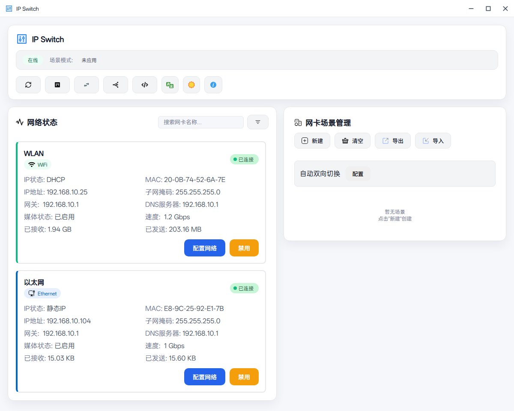
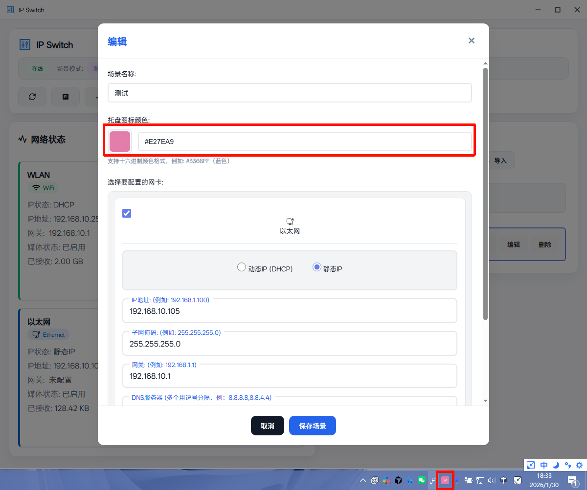
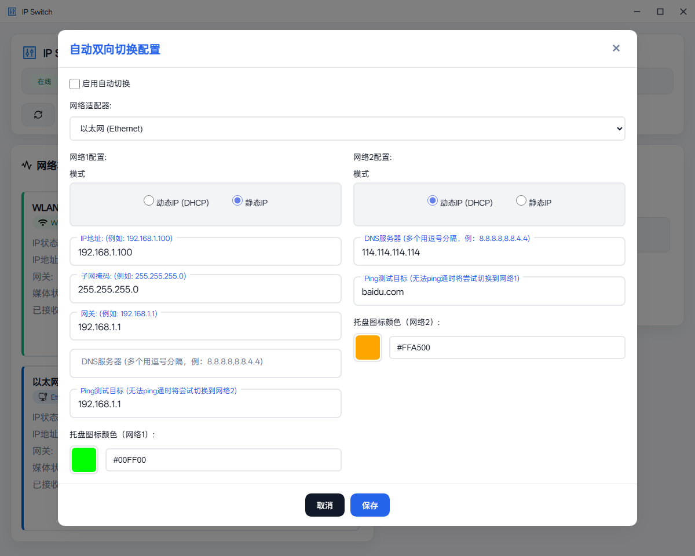

# IP Switch

IP Switch 是一款专为 Windows 桌面运维、网络运维用户打造的网络配置管理工具，未来可能也会加入海外用户功能，让复杂的网络设置变得简单高效。

### ✨ 核心优势

**🎯 一键场景切换**

- 保存多套网络配置方案，一键切换不同场景
- 工作、家庭、开发环境，随时切换，无需重复配置
- 支持静态 IP 和 DHCP 自动获取的快速切换

**🔧 智能协同管理**

- Hosts 文件编辑与管理，支持远程更新
- 代理配置集中管理，支持远程 PAC 更新
- Hosts 与代理设置智能协同，确保配置一致性

**📊 实时监控**

- 实时显示网络流量（上行/下行）
- 网络状态一目了然（WiFi/有线网络、静态/动态IP、IP详情）
- 托盘图标颜色可自定义，根据网络状态动态变化

## 🎨 功能亮点

1 网络状态一览无余

2 场景管理，轻松切换

创建多个网络场景，每个场景包含：
- IP 配置（静态 IP 或 DHCP）
- Hosts 文件配置
- 代理设置

一键切换，告别重复配置的烦恼。

3 Hosts 文件管理

4 代理配置管理

灵活的代理配置：
- 支持本地和远程 PAC 文件
- 自动更新代理规则
- 与 Hosts 配置协同工作
- 支持多种代理协议

5 双向流量监控

6 配置效果验证

## 🚀 使用场景

适用人群：桌面运维、网络运维、浏览海外服务重度用户

- **多环境切换**：开发、测试、生产环境快速切换
- **本地开发**：轻松配置本地域名解析
- **代理管理**：统一管理开发代理配置
- **网络优化**：通过 Hosts 优化访问速度
- **网络实验**：快速切换网络配置进行测试
- **流量监控**：实时了解网络使用情况
- **规则管理**：统一管理 Hosts 和代理规则

### 快速开始

1. 下载并安装 IP Switch
2. 以管理员权限运行
3. 创建第一个网络场景
4. 开始享受便捷的网络管理体验

**下载地址**：https://github.com/hoochanlon/Ip-Switch/releases

## 🎯 总结

随心切换场景，Hosts 与代理智能协同，实时流量监控 + 网络状态提醒，IP Switch 计划打造成网络管理集成工具。

